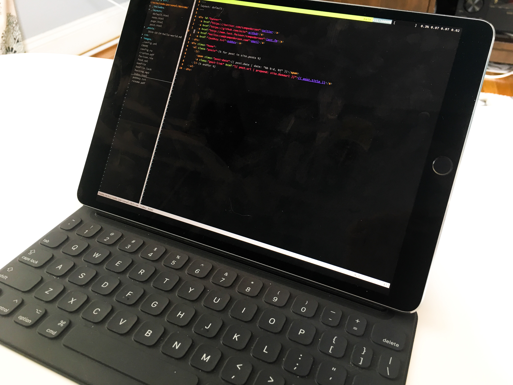
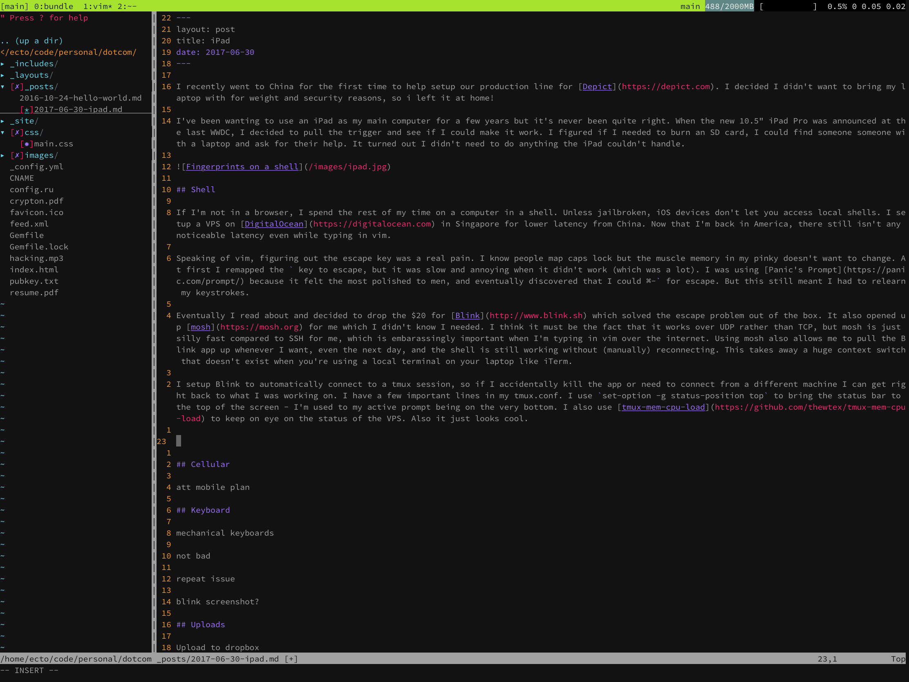

I recently went to China for the first time to help setup our production line for [Depict](https://depict.com). I decided I didn't want to bring my MacBook Pro with for weight and security reasons, so I left it at home!

I've been wanting to use an iPad as my main computer for a few years but it's never been quite right. When the new 10.5" iPad Pro was announced at the last WWDC, I decided to pull the trigger and see if I could make it work. I figured if I needed to burn an SD card, I could find someone with a laptop and ask for their help. It turned out I didn't need to do anything the iPad couldn't handle.

## Shell

If I'm not in a browser, I spend the rest of my time on a computer in a shell. Unless jailbroken, iOS devices don't let you access local shells. I setup a VPS on [DigitalOcean](https://digitalocean.com) in Singapore for lower latency from China. Now that I'm back in America, there still isn't any noticeable latency even while typing in vim.

Speaking of vim, figuring out the escape key was a real pain. I know people map caps lock but the muscle memory in my pinky doesn't want to change. At first I remapped the \` key to escape, but it was slow and annoying when it didn't work (which was a lot). I was using [Panic's Prompt](https://panic.com/prompt/) because it felt the most polished to me, and eventually discovered that I could ⌘-` for escape. But this still meant I had to relearn my keystrokes.

Eventually I read about and decided to drop the \$20 for [Blink](http://www.blink.sh) which solved the escape problem out of the box. It also opened up [mosh](https://mosh.org) for me which I didn't know I needed. I think it must be the fact that it works over UDP rather than TCP, but mosh is just silly fast compared to SSH for me, which is embarassingly important when I'm typing in vim over the internet. Using mosh also allows me to pull the Blink app up whenever I want, even the next day, and the shell is still working without (manually) reconnecting. This takes away a huge context switch that doesn't exist when you're using a local terminal on your laptop like iTerm. Another small benefit of Blink is that it allows you to customize the color scheme, so I was able to match it to exactly what I'm used to.

I setup Blink to automatically connect to a tmux session, so if I accidentally kill the app or need to connect from a different machine I can get right back to what I was working on. I have a few important lines in my tmux.conf. I use `set-option -g status-position top` to bring the status bar to the top of the screen - I'm used to my active prompt being on the very bottom. I also use [tmux-mem-cpu-load](https://github.com/thewtex/tmux-mem-cpu-load) to keep on eye on the status of the VPS. Also it just looks cool.

## Cellular

I got the cellular version of the iPad on a whim and I'm really glad I did. There's a huge psychological benefit not worrying where I can find WiFi, and a new feeling of knowing I can get a shell anywhere I get reception. With LTE everywhere, WiFi is basically just a nice-to-have if I need to download something big.

I use AT&T because they're alright and I'm too lazy to switch. Despite being assured I didn't need a new SIM card at the Apple store, I ended up having to stop by an AT&T store. I went for unlimited with tethering, which came in handy for my trip: when there was no WiFi around, I opened up a hotspot and connected the machines I was working on to my iPad - this simultaneously gave them internet access and gave me SSH access into those machines.

I also signed up for AT&T's international plan. LTE (and the internet in general) worked really well in China. I FaceTimed with my girlfriend over data while walking around Suzhou and it was almost like being on WiFi. I was even able to connect to GitHub and Google, so either the GFW has loosened up or my foreign SIM let me bypass some filters. At \$10/day it was pretty steep so I turned it off right when I got home, but if I end up going again I'll definitely look into it again.

## Keyboard

I can use Blink, LTE, and tethering on my iPhone, so why even get an iPad? 40% of the reason is the screen size difference which matters a lot when you're staring at it for a large chunk of the day. The next 40% is the keyboard.

The smart cover keyboard is a work of art - I don't think I could make anything better if I tried. You want a cover, stand, and keyboard, so why not combine all of them? It's lightweight but sturdy, especially in the lap. I really like mechanical keyboards. I have 3 at home, 2 with custom keycap sets. My favorite keyswitch is the Cherry MX Brown, but I use Clears at work so I'm not too loud. I haven't used any of them since I got the iPad. Once I got past my hangups about the layout and gave it a chance it was super easy to get used to it. To roughly compare, the keyboard feels like Blues with dampeners.

One important thing I did coming from the ⌘-Tab world is to disable extraneous animations. You can find this in `Settings -> General -> Accessibility -> Reduce Motion`. I came across this by accident but it makes a world of difference in reducing latency between window switches.

The escape thing I covered earlier was annoying at first but I got past it. There's still two remaining issue I have though:

1. The "globe" button on the bottom right, where control is on a standard layout, opens the next software keyboard, which opens a huge emoji screen anytime I accidentally press it - which is a lot because control is a pretty important key in a shell.
2. Sometimes a key will stick when I ⌘-Tab into another app. This is usually just minorly annoying, and I'm not sure what the actual problem is, but worst case scenario is that I have a million Blink tabs open when I come back to the app. This means I have to sit there and close out a bunch of tabs or kill the app, which takes me out of my flow. It sounds little but when it happens once an hour it adds up.

## The small stuff

### Uploads

Getting files to my VPS was an unexpected problem. Usually I'll just `mv` a file but now I have to upload it to Dropbox or a different service, generate a share link, then `wget` it onto my server. This isn't really a big deal but it's a weird detour and adds a little bit of cognitive load through the day. Hopefully Blink or Prompt will somehow add support for file uploads with iOS 11 drag and drop. I'm not sure how this would work - FTP?

### Physical world

It's probably obvious, but here's my last 20% reason to use the iPad: this thing is so much lighter than my MacBook Pro. My backpack itself is heavier than the iPad... I'll probably get used to the weight difference eventually but for now it feels so good to have that literal weight off my shoulders. I'm still undecided if I want to throw stickers on it.

### Apps

Slack works really well on the iPad unsuprisingly, but I haven't quite figured out my notification strategy for it yet - I'm never sure where push notifications are going to go.

I've been a mobile web holdout on my iPhone, but I gave the Google Docs/Sheets apps a shot and they're really nice, particularly with deep linking. The simple face of the Docs app being full screen helps me to concentrate moreso than when it's a window on my computer and I've found it very helpful to my productivity lately.

## Conclusion

I've used the iPad as my main computer for 2 weeks now. I'm probably going to pull all the files from my old MBP into cloud storage (not just a backup) and go all in with the iPad. The benefits compelled me enough to write about it and share the possibility with others. Maybe I'm just a goober though.
